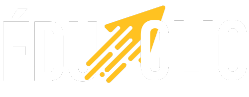

# EduClick - Modern Learning Management System

EduClick is a comprehensive Learning Management System (LMS) built with modern web technologies. It provides a robust platform for both educators and students, featuring course management, video content delivery, and integrated payment processing.



## 🌟 Features

### For Students
- 📚 Browse & filter courses
- 💳 Secure course purchases through Stripe
- 📝 Track progress with chapter completion
- 📊 Personal dashboard with progress tracking
- 🎥 High-quality video streaming with HLS

### For Teachers
- 📝 Comprehensive course creation tools
- 📹 Video upload and processing via Mux
- 📎 File attachments and course materials
- ✏️ Rich text editor for detailed descriptions
- 🔄 Drag-and-drop chapter reordering

### Technical Features
- 🔐 Authentication using Clerk
- 💾 MySQL Database with Prisma ORM
- 🎨 Modern UI with Tailwind CSS
- 🚀 Built on Next.js 13
- 📤 File uploads via UploadThing

## 🚀 Getting Started

### Prerequisites
- Node.js 18.x.x
- MySQL database (We recommend PlanetScale)
- Accounts for:
  - Clerk (Authentication)
  - UploadThing (File storage)
  - Mux (Video processing)
  - Stripe (Payments)

### Installation

1. Clone the repository:
```bash
git clone https://github.com/ismailsoud/EduClick.git
```

2. Install dependencies:
```bash
npm install
```

3. Configure environment variables:
Create a `.env` file with the following:
```env
NEXT_PUBLIC_CLERK_PUBLISHABLE_KEY=
CLERK_SECRET_KEY=
NEXT_PUBLIC_CLERK_SIGN_IN_URL=
NEXT_PUBLIC_CLERK_SIGN_UP_URL=
NEXT_PUBLIC_CLERK_AFTER_SIGN_IN_URL=
NEXT_PUBLIC_CLERK_AFTER_SIGN_UP_URL=

DATABASE_URL=

UPLOADTHING_SECRET=
UPLOADTHING_APP_ID=

MUX_TOKEN_ID=
MUX_TOKEN_SECRET=

STRIPE_API_KEY=
NEXT_PUBLIC_APP_URL=http://localhost:3000
STRIPE_WEBHOOK_SECRET=

NEXT_PUBLIC_TEACHER_ID=
```

4. Initialize the database:
```bash
npx prisma generate
npx prisma db push
```

5. Start the development server:
```bash
npm run dev
```

## 🛠️ Tech Stack

- **Frontend**: Next.js 13, React, Tailwind CSS
- **Backend**: Next.js API Routes
- **Database**: MySQL with Prisma ORM
- **Authentication**: Clerk
- **File Storage**: UploadThing
- **Video Processing**: Mux
- **Payments**: Stripe
- **UI Components**: Radix UI, Material-UI
- **State Management**: Zustand
- **Forms**: React Hook Form
- **Data Validation**: Zod

## 🤝 Contributing

We welcome contributions to EduClick! Please feel free to submit issues and pull requests.

1. Fork the repository
2. Create your feature branch (`git checkout -b feature/AmazingFeature`)
3. Commit your changes (`git commit -m 'Add some AmazingFeature'`)
4. Push to the branch (`git push origin feature/AmazingFeature`)
5. Open a Pull Request

## 👥 Authors

- **Ismail Soudassi** - *Initial work*
- **Abdelmounim Ikhwane** - *Initial work*

## 📄 License

This project is licensed under the MIT License - see the [LICENSE](LICENSE) file for details.

## 🙏 Acknowledgments

- Thanks to all contributors who have helped shape EduClick
- Special thanks to the open-source community for the amazing tools that made this possible
